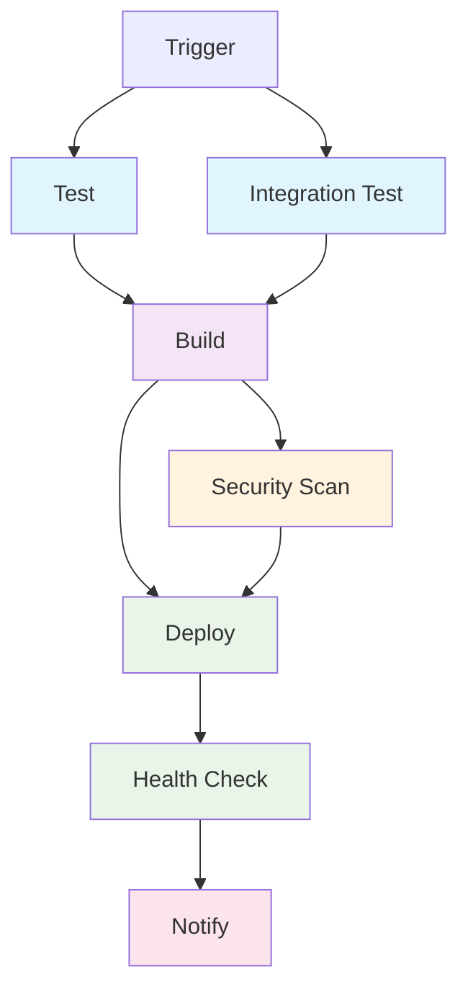

# Granular CI/CD Pipeline Architecture

## Overview

The CI/CD pipeline has been restructured into **granular, focused jobs** that run in parallel where possible and provide better visibility into each stage of the deployment process.

## Pipeline Jobs

### 1. **Test** 🧪
- **Purpose**: Run unit tests and code quality checks
- **Runs on**: Every push and PR
- **Dependencies**: None (runs immediately)
- **Includes**:
  - Node.js setup and dependency installation
  - Unit tests (`npm test`)
  - Code linting (placeholder for ESLint)

### 2. **Integration Test** 🔗
- **Purpose**: Test database connectivity and integration
- **Runs on**: Every push and PR
- **Dependencies**: `test` job must pass
- **Includes**:
  - Spin up PostgreSQL test database
  - Run database schema initialization
  - Test Node.js → Database connectivity
  - Cleanup test resources

### 3. **Build** 🏗️
- **Purpose**: Build and push Docker image
- **Runs on**: Every push and PR (after tests pass)
- **Dependencies**: Both `test` and `integration-test` must pass
- **Includes**:
  - Docker image build with production settings
  - Push to GitHub Container Registry
  - Generate image metadata and tags
- **Outputs**: Image digest and tags for downstream jobs

### 4. **Security Scan** 🔒
- **Purpose**: Security vulnerability scanning
- **Runs on**: After successful build
- **Dependencies**: `build` job must pass
- **Includes**:
  - Generate Software Bill of Materials (SBOM)
  - Trivy vulnerability scanning
  - Upload results to GitHub Security tab
  - Store security artifacts

### 5. **Deploy** 🚀
- **Purpose**: Deploy to production EC2 instance
- **Runs on**: Only on `main` branch pushes
- **Dependencies**: Both `build` and `security-scan` must pass
- **Environment**: `production` (enables environment protection rules)
- **Includes**:
  - Deploy database and application via SSM
  - Wait for deployment completion
  - Basic deployment verification

### 6. **Health Check** 🏥
- **Purpose**: Comprehensive post-deployment validation
- **Runs on**: After successful deployment
- **Dependencies**: `deploy` job must pass
- **Includes**:
  - Container status verification
  - Database connectivity and schema validation
  - Application endpoint testing
  - Resource usage monitoring
  - Recent log analysis

### 7. **Notify** 📢
- **Purpose**: Deployment status notification and summary
- **Runs on**: Always (even if previous jobs fail)
- **Dependencies**: `deploy` and `health-check` jobs (waits for both)
- **Includes**:
  - Generate deployment summary
  - Report overall status
  - Create GitHub Step Summary

## Pipeline Flow



## Parallel Execution

- **Tests run in parallel**: `test` and `integration-test` can run simultaneously
- **Security scanning**: Runs in parallel with deployment preparation
- **Health check**: Runs after deployment completes
- **Notification**: Always runs last with status from all jobs

## Benefits

### 🚀 **Performance**
- Parallel job execution reduces total pipeline time
- Early failure detection stops unnecessary work
- Cached dependencies speed up subsequent runs

### 🔍 **Visibility**
- Each job has a specific focus and clear responsibility
- Easier to identify which stage failed
- Better logs and artifacts organization
- GitHub UI shows clear progress through pipeline stages

### 🛠️ **Maintainability**
- Jobs are focused and easier to modify
- Can add/remove jobs without affecting others
- Individual job testing and debugging
- Clear separation of concerns

### 🔒 **Security**
- Dedicated security scanning job
- Environment protection for production deployments
- Proper permission scoping per job
- Security artifacts properly stored

### 📊 **Monitoring**
- Comprehensive health checks post-deployment
- Resource usage monitoring
- Detailed deployment summaries
- Integration with GitHub's status checks

## Job Dependencies

```
test ──┐
       ├─► build ──┐
integration-test ──┘     ├─► deploy ──► health-check ──► notify
                         │
        security-scan ───┘
```

## Environment Protection

The `deploy` job uses the `production` environment, which allows you to:
- Set up deployment approvals
- Restrict who can deploy to production
- Add environment-specific secrets
- Set deployment windows

## Configuration

### Required Secrets
- `AWS_ROLE_ARN`: AWS IAM role for OIDC
- `AWS_REGION`: AWS deployment region  
- `EC2_INSTANCE_NAME`: EC2 instance tag name
- `ENV_FILE_B64`: Base64 encoded production environment file
- `GHCR_READ_TOKEN`: GitHub Container Registry token (optional)

### Optional Enhancements
- Add Slack/Discord notifications in the `notify` job
- Implement deployment rollback in case of health check failures
- Add performance testing as a separate job
- Include smoke tests for critical user journeys

## Monitoring and Alerting

Each job produces specific artifacts and logs:
- **Test**: Unit test results and coverage
- **Integration**: Database connectivity reports
- **Build**: Docker image metadata
- **Security**: SBOM and vulnerability reports
- **Deploy**: Deployment logs and status
- **Health Check**: System status and metrics
- **Notify**: Overall deployment summary

This granular approach provides better control, visibility, and reliability for your deployment pipeline! 🎉